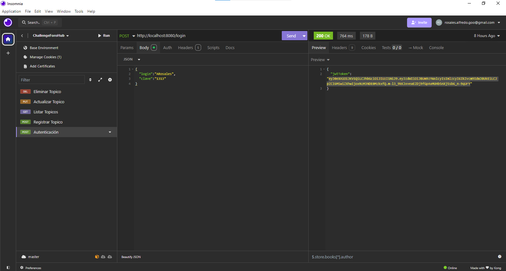
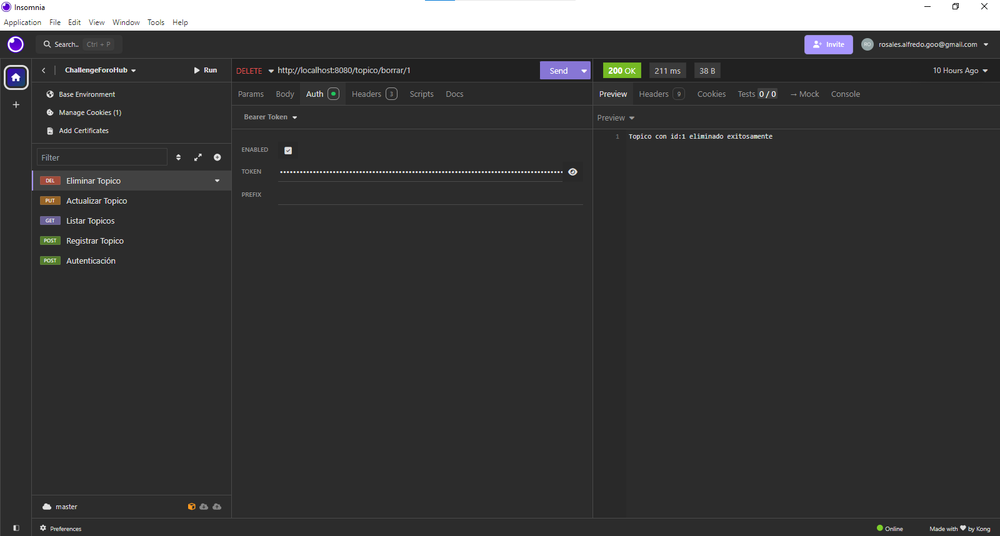
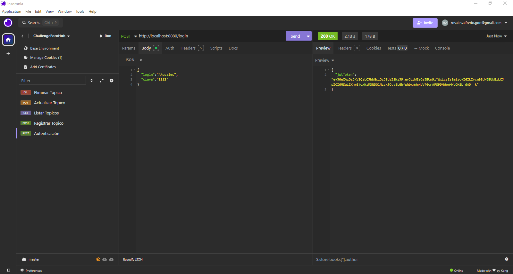
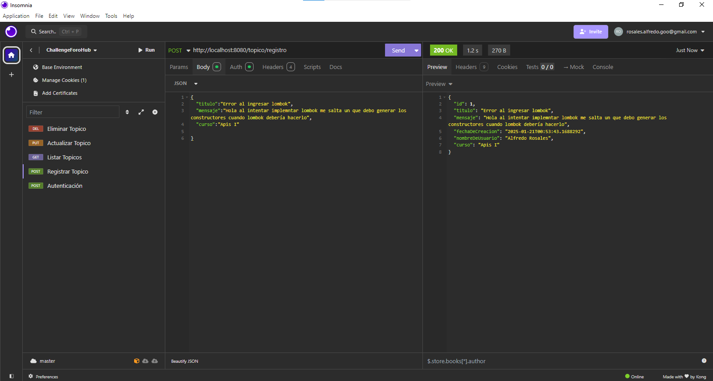

# ForoHub


## Descripción

Foro Hub es una API REST desarrollada en Java utilizando el framework Spring. 
Este proyecto tiene como objetivo replicar un foro funcional enfocado en la gestión de tópicos, permitiendo realizar operaciones básicas de CRUD (Crear, Leer, Actualizar y Eliminar) 
de manera eficiente y siguiendo las mejores prácticas del modelo REST.

## :pencil: Características

- **Modelo REST:** Las rutas y la estructura de la API siguen las mejores prácticas REST para garantizar claridad y consistencia.
- **Validaciones:** Se implementan reglas de negocio para garantizar la validez de los datos ingresados.
- **Base de datos:** La API utiliza una base de datos relacional para permanencia y gestion de la información de los tópicos.
- **Autenticación y autorización:** Se incluye un sistema de seguridad para restringir el acceso a las funcionalidades según roles y permisos.


## Tecnologías Utilizadas

**Java:** Lenguaje principal para el desarrollo de la API.

**Spring Framework:** Framework utilizado para la implementación del backend.

**Spring Boot:** Para simplificar la configuración y el despliegue de la aplicación.

**Spring Security:** Manejo de autenticación y autorización.

**Hibernate:** ORM para la gestión de datos en la base de datos.

**Base de Datos:** Utilización de una base de datos relacional (MySQL en especifico la app de MySQL Workbench).

## :scroll: Funcionalidades

**Crear un nuevo tópico:** Los usuarios pueden crear nuevos tópicos proporcionando información relevante como el título y el contenido.

**Mostrar todos los tópicos creados:** La API permite listar todos los tópicos almacenados en la base de datos.

**Mostrar un tópico específico:** Los usuarios pueden consultar la información de un tópico específico utilizando su identificador.

**Actualizar un tópico:** Es posible modificar la información de un tópico existente.

**Eliminar un tópico:** Los usuarios pueden eliminar tópicos que ya no sean necesarios.


## :hammer_and_wrench: Instalación y Configuración

1. Clona este repositorio o descarga los archivos.

```bash
    git clone https://github.com/AlfredoRosales12/ChallengeForoHub
``` 

2. Configura las variables de entorno.

spring.datasource.url=jdbc:mysql://localhost:8080/ChallengeForoHub
spring.datasource.username=tu_usuario
spring.datasource.password=tu_contraseña
spring.jpa.hibernate.ddl-auto=update

3.Ejecuta el proyecto

4.Registro de usuarios.
Registra manualmente los usuarios en la base de datos. Asegúrate de almacenar las contraseñas en formato hash utilizando un algoritmo seguro como BCrypt. Por ejemplo, puedes usar un script o una herramienta como MySQL Workbench para insertar los datos en la tabla users.

Ejemplo de registro manual:
```bash
    INSERT INTO users (nombre, login, clave,) 
    VALUES ('Alfredo Rosales','usuario1', '$2a$10$EjemploDeHashDeBCrypt');
``` 

5. Utiliza alguna herramienta de pruebas de API como Insomnia o Postman
Ejemplo:



Al utilizar alguna herramienta de prueba asegurate de autenticarte antes de poder hacer alguna consulta o registro a la API.
al autenticarte la API te generará un token el cual debras ingresar enla seccion auth y ahí pondras Bearer token.




## Ejemplos de Uso

1. Autenticación de usuario:



2. Registro de topico:




## Seguridad: 

La API utiliza JWT (JSON Web Tokens) para la autenticación y autorización. Solo los usuarios autenticados pueden acceder a los endpoints protegidos


## Contribuciones:

Las observaciones, contribuciones,etc.  son bienvenidas. Si encuentras algún error o tienes alguna sugerencia, por favor, abre un issue en este repositorio.

## :copyright: Licencia:

Este proyecto está bajo la licencia OpenSource, Creado por Alfredo Rosales [@AlfredoRosales12](https://github.com/AlfredoRosales12)

¡Diviértete con la API!

## :iphone: Contact

Te puedes comunicar conmigo a través de los siguientes canales de comunicación:

- [Discord](https://discord.com):
  - `@Alfredo Rosales` Nombre de Usuario
- [LinkedIn][@Alfredo Rosales](https://www.linkedin.com/in/alfredo-rosales-aguilar-5048b0264/)
- [GitHub][@AlfredoRosales12](https://github.com/AlfredoRosales12)
- [Correo Electronico][rosales.alfredo.goo@gmail.com]
